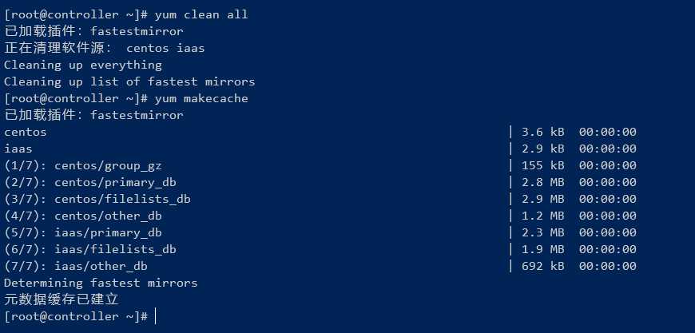
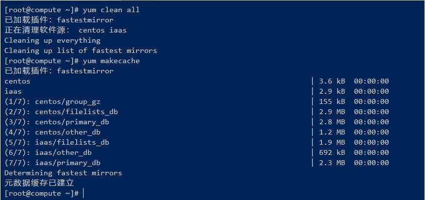
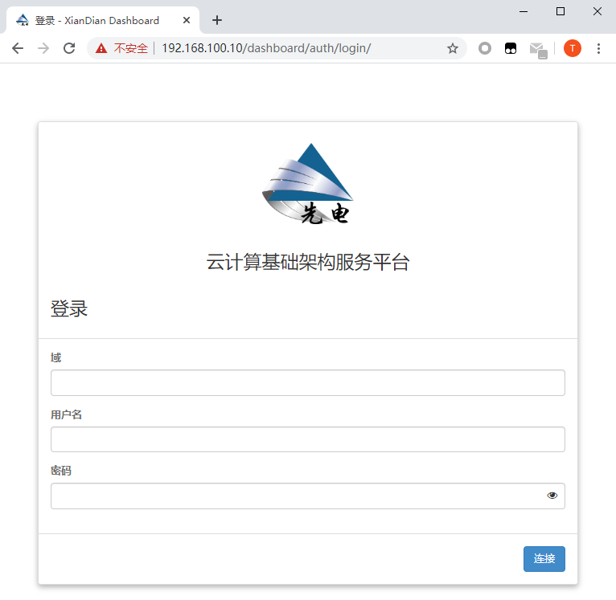
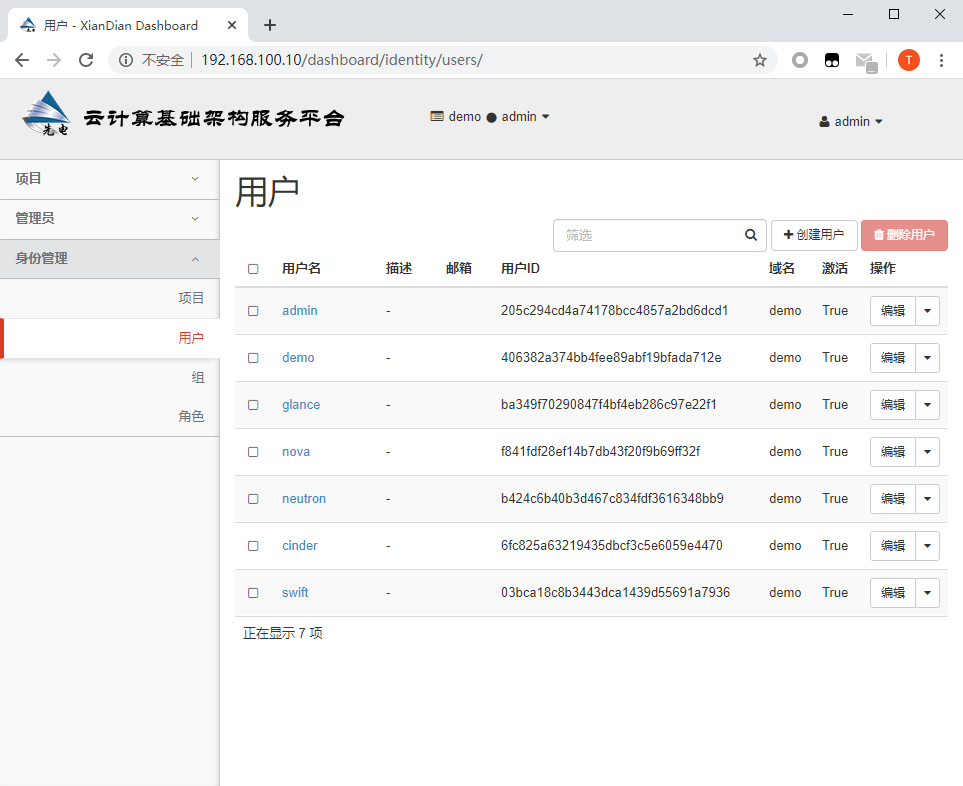

# 先电 OpenStack 初级配置

***<p align="right" size=1>By:Chronos</p>***

## 安装系统

### 最小化安装 Centos7 & 配置 网卡

1. nmtui 设置网卡 重启网卡

    ```
    nmtui

    service network restart
    ```

2. 设置主机名

   控制节点：controller

   计算节点：compute

   <font color="green">（可略后期脚本会自动修改)</font>

    ```
    hostnamectl set-hostname controller         #控制节点

    hostnamectl set-hostname compute            #计算节点
    ```

3. 修改 hosts 解析文件

    通过 echo -e 编译赋值至hosts文件
    ```
    echo -e "192.168.100.10     controller /n 192.168.100.20  compute">/etc/hosts
    ```

## 初始环境配置

### Controller 节点基础配置

1. 创建光盘挂载位置

   ```
    mkdir /opt/centos7
    mkdir /opt/iaas
   ```

2. 设置光盘自动挂载

    ```
   echo "/root/CentOS-7-x86_64-DVD-1511.iso  /opt/centos7  iso9660  defaults 0 0" >>/etc/fstab
   echo "/root/XianDian-IaaS-v2.2.iso        /opt/iaas     iso9660  defaults 0 0" >>/etc/fstab
   mount -a         #自动挂载
   ```

3. 配置本地Yum源文件

    ```
    rm -rf /etc/yum.repo.d/CentOS-*
    vi /etc/yum.repo.d/local.repo

    [centos]
    name = centos
    baseurl = file:///opt/centos7
    gpgcheck = 0
    enabled = 1

    [iaas]
    name = iaas
    baseurl = file:///opt/iaas/iaas-repo
    gpgcheck = 0
    enabled = 1
    ```

4. 清除缓存换源

    ```
    yum clean all
    yum makecache
    ```

5. Controller 本地 Yum源 配置结果

    <div align=center>

    

6. 在 Controller 安装&配置 FTP 服务端

    Controller 节点安装 FTP 服务

    ```
    yum install -y vsftpd
    ```

    编辑 FTP 主目录文件

    ```
    vi /etc/vsftpd/vsftpd.conf

    anon_root=/opt
    ```

    重启 vsftpd 服务

    ```
    systemctl restart vsftpd
    ```

7. 配置防火墙

    Controller 配置防火墙策略

    ```
    setenforce 0     #临时关闭SELinux
    ```

    删除防火墙内置规则

    ```
    iptables -F
    iptables -X
    iptables -Z
    ```

    关闭 firewalld 服务

    ```
    systemctl stop firewalld
    ```

### Compute 节点基础配置

1. 配置防火墙

    Compute 配置防火墙策略

    ```
    setenforce 0     #临时关闭SELinux
    ```

    删除防火墙内置规则

    ```
    iptables -F
    iptables -X
    iptables -Z
    ```

    关闭firewalld服务

    ```
    systemctl stop firewalld
    ```

2. 配置 FTP Yum源 文件

    ```
    rm -rf /etc/yum.repo.d/CentOS-*
    vi /etc/yum.repo.d/local.repo

    [centos]
    name = centos
    baseurl = ftp://192.168.100.10/centos7
    gpgcheck = 0
    enabled = 1

    [iaas]
    name = iaas
    baseurl = ftp://192.168.100.10/iaas/iaas-repo
    gpgcheck = 0
    enabled = 1
    ```

3. 清除缓存换源

    ```
    yum clean all
    yum makecache
    ```

4. Compute FTP Yum源 配置结果

    <div align=center> 

    

    <div align=center> 
    <font color="red">至此建议拍摄快照</font>

## 正式开始安装

1. 在 Controller & Compute 节点 安装先电云计算平台初始环境

    ```
    yum install -y iaas-xiandian
    ```

2. 编辑 openrc.sh 脚本

    ```
    vim /etc/xiandian/openrc.sh

    ##--------------------system Config--------------------##
    ##Controller Server Manager IP. example:x.x.x.x
    HOST_IP=192.168.100.10

    ##Controller Server hostname. example:controller
    HOST_NAME=controller

    ##Compute Node Manager IP. example:x.x.x.x
    HOST_IP_NODE=192.168.100.20

    ##Compute Node hostname. example:compute
    HOST_NAME_NODE=compute

    ##--------------------Rabbit Config ------------------##
    ##user for rabbit. example:openstack
    RABBIT_USER=openstack

    ##Password for rabbit user .example:000000
    RABBIT_PASS=000000

    ##--------------------MySQL Config---------------------##
    ##Password for MySQL root user . exmaple:000000
    DB_PASS=000000

    ##--------------------Keystone Config------------------##
    ##Password for Keystore admin user. exmaple:000000
    DOMAIN_NAME=demo
    ADMIN_PASS=000000
    DEMO_PASS=000000

    ##Password for Mysql keystore user. exmaple:000000
    KEYSTONE_DBPASS=000000

    ##--------------------Glance Config--------------------##
    ##Password for Mysql glance user. exmaple:000000
    GLANCE_DBPASS=000000

    ##Password for Keystore glance user. exmaple:000000
    GLANCE_PASS=000000

    ##--------------------Nova Config----------------------##
    ##Password for Mysql nova user. exmaple:000000
    NOVA_DBPASS=000000

    ##Password for Keystore nova user. exmaple:000000
    NOVA_PASS=000000

    ##--------------------Neturon Config-------------------##
    ##Password for Mysql neutron user. exmaple:000000
    NEUTRON_DBPASS=000000

    ##Password for Keystore neutron user. exmaple:000000
    NEUTRON_PASS=000000

    ##metadata secret for neutron. exmaple:000000
    METADATA_SECRET=000000

    ##External Network Interface. example:eth1
    INTERFACE_NAME=eno33554960                 #第二块网卡名

    ##--------------------Cinder Config--------------------##
    ##Password for Mysql cinder user. exmaple:000000
    CINDER_DBPASS=000000

    ##Password for Keystore cinder user. exmaple:000000
    CINDER_PASS=000000

    ##Cinder Block Disk. example:md126p3
    #BLOCK_DISK=sdb                            # Compute 磁盘 1

    ##--------------------Swift Config---------------------##
    ##Password for Keystore swift user. exmaple:000000
    SWIFT_PASS=000000

    ##The NODE Object Disk for Swift. example:md126p4.
    OBJECT_DISK=sdc                            # Compute 磁盘 2

    ##The NODE IP for Swift Storage Network. example:x.x.x.x.
    STORAGE_LOCAL_NET_IP=192.168.100.20        # Compute IP

    ```

    按照顺序输入IP地址信息、主机名、密码

    INTERFACE_NAME 输入的是当前节点第二块网卡的名称

    BLOCK_DISK & OBJECT_DISK 输入的是 cinder 服务 swift 服务所使用的空分区

    STORAGE_LOCAL_NET_IP 输入的是计算节点 compute IP地址

    <font color="red" ><div align=center>此文件 Controller 与 Compute 通用 可用 scp 相互快速复制</font>

    <font color="red"><div align=center> 注意取消注释</font>

3. 在 Controller & Compute 节点安装基础服务

    ```
    iaas-pre-host.sh
    ```

    安装完成后 ， logout 退出重新登录 ，主机名变更则生效

4. Controller 节点运行安装以下三个服务

    ```
    iaas-install-mysql.sh

    iaas-install-keystone.sh

    iaas-install-glance.sh
    ```

5. 安装 Nova 计算 服务

    Controller 运行安装

    ```
    iaas-install-nova-controller.sh
    ```

    Compute 运行安装

    ```
    iaas-install-nova-controller.sh
    ```

6. 安装 Neutron 网络 服务

    Controller 运行安装

    ```
    iaas-install-neutron-controller.sh

    iaas-install-neutron-controller-gre.sh
    ```

    Compute 运行安装

    ```
    iaas-install-neutron-compute.sh

    iaas-install-neutron-compute-gre.sh
    ```

7. Controller 节点运行安装 Dashboard 服务

    ```
    iaas-install-dashboard.sh
    ```

8. 安装 Cinder 块存储 服务

    Controller 运行安装

    ```
    iaas-install-cinder-controller.sh
    ```

    Compute 运行安装

    ```
    iaas-install-cinder-compute.sh
    ```

9. 安装 Swift 对象存储 服务

    Controller 运行安装

    ```
    iaas-install-swift-controller.sh
    ```

    Compute 运行安装

    ```
    iaas-install-swift-compute.sh
    ```

## 最终验证：

- 打开浏览器，访问http://192.168.100.10/dashboard

    <div align=center> 

    

- 登陆后即出现Dashboard系统

    <div align=center> 

    